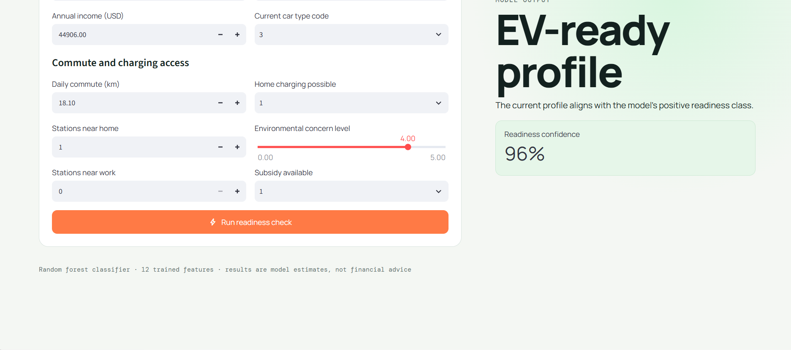
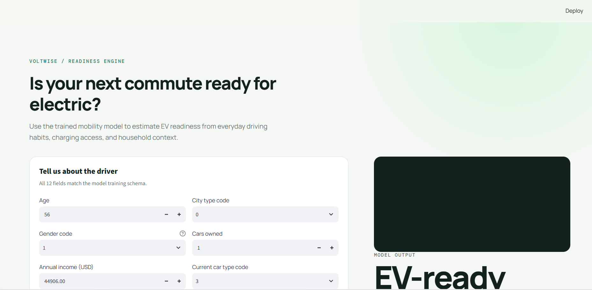

# EV Range Anxiety Prediction

This project analyzes a dataset related to Electric Vehicle (EV) adoption, behavior, and range anxiety. Range anxiety is a common concern among potential EV buyers and refers to the fear that an EV may not have enough range to complete a trip, causing the driver to become stranded.
---


---
The primary goal of this project is to build a predictive model that can identify individuals who are likely to experience high range anxiety based on demographic, economic, and behavioral factors.

## Objective
The main objective is to develop a model that predicts whether a person is likely to have high EV range anxiety using variables such as:
- age
- gender
- income
- city type
- commute distance
- car ownership
- current vehicle type
- charging infrastructure access
- home charging availability
- environmental concern
- subsidy availability
- other behavioral and lifestyle indicators

This helps EV manufacturers, policymakers, and mobility planners design better strategies to reduce range anxiety and increase EV adoption.

## Problem Statement
Range anxiety is one of the biggest barriers to EV adoption. If individuals feel uncertain about driving distance, charging accessibility, or vehicle reliability, they are less likely to switch from traditional fuel vehicles to electric ones.

This project aims to:
- understand which factors contribute to high range anxiety
- analyze the relationship between demographic and mobility patterns and EV readiness
- build a predictive classification model for identifying high-risk individuals
- support better EV adoption strategies and consumer education

## Project Scope
This repository includes:
- dataset analysis and preprocessing
- exploratory data analysis (EDA)
- feature engineering and model training
- classification model evaluation
- EV readiness and range anxiety prediction workflow
- optional web-based prediction interface using Streamlit

## Dataset
The dataset contains information related to:
- personal characteristics
- economic indicators
- travel patterns
- vehicle ownership
- charging access
- environmental concerns
- EV adoption readiness

The target variable is used to determine whether a user is more likely to experience high range anxiety or not.

## Workflow
The project follows a typical machine learning workflow:
1. Data collection and inspection
2. Data cleaning and handling missing values
3. Exploratory data analysis
4. Feature selection and preprocessing
5. Model training
6. Hyperparameter tuning (if applicable)
7. Model evaluation
8. Prediction and interpretation
9. Deployment or visualization (if used)

## Tools and Libraries
- Python
- Jupyter Notebook
- Pandas
- NumPy
- Matplotlib
- Seaborn
- scikit-learn
- joblib
- Streamlit (for app deployment, if configured)

## Project Structure
```text
Mobile price prediction/
│
├── app.py                  # Streamlit prediction app
├── model.pkl              # Trained ML model
├── README.md              # Project documentation
├── notebook.ipynb         # Analysis and modeling notebook
├── data/                  # Dataset files (if included)
├── requirements.txt       # Package dependencies
